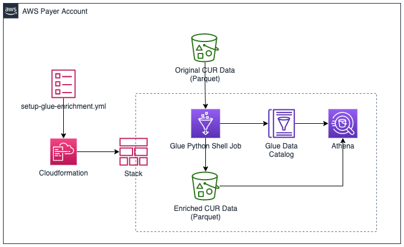

# Glue Cost and Usage Report Enrichment

This package creates a Glue Python Shell Job that will enrich [Cost and Usage Report](https://docs.aws.amazon.com/cur/latest/userguide/what-is-cur.html) data by creating additional columns with [AWS Organizations Account tags](https://docs.aws.amazon.com/organizations/latest/userguide/orgs_tagging.html). Tag column values are set by joining the values on `line_item_account_usage_id`. This makes it possible to filter/group CUR data by account-level tags. An example use case is to create an Organizations tag, BudgetCode, for each AWS account and then use this script to add the BudgetCode to every line item in the report so that chargeback reports can be generated.

This script uses the [AWS Data Wrangler](https://github.com/awslabs/aws-data-wrangler) package to perform the bulk of the ETL work, and also to create the table definition in Glue so that the encriched reports can be queried using Athena.



## Functionality
- The script uses a Glue Python Shell Job to process the CUR data, merge the account tags, and then rewrite the "enriched" data in Parquet to another S3 bucket and/or path.
- The AWS account information, including account tags, is collected from the AWS Organizations API and written to S3. A table is defined in the Glue data catalog so that it can be queried.
- The script can also create a table in Glue that can be used to perform queries in Athena. You could also define use a Glue crawler for this purpose.
- Optionally, it can also further partition the data by line_item_account_id. 
- The Glue job can be configured to process all CUR files in S3, or it can perform an "Incremental" processing, where it will only process CUR files from the last x months. It is recommended that you do a one time full processing/enrichment on all CUR files and then periodic "Fulls" 
- The Python Shell script uses the [AWS Data Wrangler](https://aws-data-wrangler.readthedocs.io/en/latest/) package. This package extends the Pandas library, making it easy to work with Athena, Glue, S3, RedShift, Cloudwatch Logs, Aurora, SageMaker, DynamoDB, and EMR. 

### Technical Note
The Python Shell script originally used Pandas DataFrames to perform the ETL operations. In later released, this has been offloaded to Athena CREATE TABLE AS SELECT statements with temporary Glue data catalog tables. One motivator for this approach was work around Spark and pyarrow's limited support for Delta encoded columns, which CUR data written in Parquet format [occasionally contains](https://github.com/awslabs/aws-data-wrangler/issues/442). If you want to see the original script, you can find it in [this commit](https://github.com/aws-samples/glue-enrich-cost-and-usage/tree/333e8af620bea2dde41e5126fc558ba6eecc94bc). 

## Prerequisites
1. *An AWS Account and AWS Organizations enabled:*  In order to use Organizations tags with accounts, AWS Organizations must be enabled. **The resources used in this blog post must be deployed in the master account.**
2. *Cost & Usage Report*: A Cost & Usage Report must be defined in the Master account. The report must be written in Apache Parquet format to an S3 bucket. Instructions for creating a Cost & Usage Report are available in the AWS Documentation (https://docs.aws.amazon.com/cur/latest/userguide/cur-create.html).  *Please note:* Once you’ve setup a Cost & Usage Report, it can take up to 24 hours for the first report to be delivered to S3. You will not be able to use this solution until you have at least one report delivered


## How it works

The CloudFormation template used in the setup below creates the following resources:

* **Glue Python Shell Jobs**- These shell jobs contain Python scripts that will perform the ETL operations, loading the data from the existing Cost & Usage Report files and then writing the processed dataset back to S3. One job will perform a “Full” ETL on all existing report data, while the other job will perform an “Incremental” ETL on data from the past 2 months. 
    
    **Note**: Glue Jobs are billed per second (https://aws.amazon.com/glue/pricing/), with a 10-minute minimum. In most environments, the incremental job should take less than 10 minutes to complete and is estimated to cost less than $0.15 per day to run. Customers that wish to process all historical Cost & Usage Data or that have dozens or hundreds of AWS accounts can monitor the job duration and logs for a more accurate estimate.
    
* **Glue Database**- The database will be used to store metadata about our enriched Cost & Usage Report data. This is primarily so we can perform queries in Athena later. 
    
* **S3 Bucket**- This bucket will store Python shell scripts and also our enriched Cost & Usage Data. Glue Python Shell Jobs execute a Python script that is stored in S3. Additional Python libraries can also be loaded from .whl and .egg files located in S3. 
    
* **IAM Role for Glue Jobs**- Glue Jobs require an IAM role with permissions to access the resources they will interact with. 

The Python script used by Glue leverages the [AWS Data Wrangler](https://aws-data-wrangler.readthedocs.io/en/latest/what.html) library. This package extends the popular Pandas library to AWS services, making it easy to connect to, load, and save [Pandas](https://github.com/pandas-dev/pandas) dataframes with many AWS services, including S3, Glue, Redshift, EMR, Athena, and Cloudwatch Log Insights. In a few lines of code, the script performs the following steps:

1. Loads each Cost & Usage Report parquet file from S3 into a pandas dataframe
2. Merges the all AWS Account tags (retrieved via the Organizations API) with each line item, based on the line_item_usage_account_id column
3. Writes each dataframe to the S3 Bucket, partitioned by year, month, and line_item_usage_account_id for potentially [more efficient Athena queries](https://aws.amazon.com/blogs/big-data/top-10-performance-tuning-tips-for-amazon-athena/)
4. Creates a table in the Glue Database with the enriched Cost & Usage Report data and refreshes the table

When the Glue job completes the enriched reports can be queried via Athena, as demonstrated below.

## Setup

**Note:** This will NOT modify your existing CUR data files. Instead, it creates a copy of the data in a separate bucket. It is recommended that you retain the original CUR files for backup.

1. First, use the [AWS Organizations](https://console.aws.amazon.com/organizations/home?region=us-east-1#/accounts) console to add the tags you’d like to have included in your enriched Cost & Usage Reports.

2. Deploy the CloudFormation template, setup-glue-encrichment.yml. Specify the source bucket name and prefix (path) where the current CUR files are located.

3. After the CloudFormation stack is created, go to outputs and click the link to the S3 bucket that the stack created.

4. Upload: awswrangler-2.5.0-py3-none-any.whl and glue-enrich-cur.py

5. **To add the tags to all historical CUR data**, go to the [AWS Glue console](https://console.aws.amazon.com/glue/home?region=us-east-1#etl:tab=jobs) and run the `aws-cur-enrichment-full` job. If you would prefer to limit this, you can use the `aws-cur-enrichment-incremental` job instead. 

6. (Optional) Schedule `aws-cur-enrichment-incremental` to run once a day. You could also make this event-driven by using S3 events so that it runs each time a new CUR file is delivered. This incremental job will update the accounts tags for the current month AND the previous month. This makes the job run faster, process less data, and avoids altering accounts tags from previous month reports so that the behavior is similar to cost allocation tags (where tags are not retroactively modified in historical CUR data).

7. Go to the [Athena console](https://console.aws.amazon.com/athena/home?region=us-east-1#preview/cost_and_usage_enriched/cur_enriched) and run the following query:
    ```sql
    SELECT * FROM "cost_and_usage_enriched"."cur_enriched" limit 10;
    ```

    Search for the column names that begin with `account_tag_` in the results and you will see your account tags (if they exist for the `line_item_usage_account_number`, otherwise the field for that record will be blank).

    This is an example query that will return results where the account has `CostCenter` tag:
    ```sql
    SELECT * FROM "cost_and_usage_enriched"."cur_enriched" 
    WHERE tag_costcenter <> ''
    limit 10;
    ```
## Additional Features
The Glue jobs are configured to pass arguments to the script that determine how it will process the CUR. This can be modified by custoizing the arguments passed to the script. Additionally, the script can be used outside of a Glue job as a command line utility. In particular, the `--include_fields`, `--exclude_fields`, `--include_account_tags`, and `--exclude_account_tags` arguments could be useful for filtering columns or tags in the enriched report. Below are the options that the script accepts as input:

```
usage: glue-enrich-cur.py [-h] --s3_source_bucket S3_SOURCE_BUCKET --s3_source_prefix S3_SOURCE_PREFIX --s3_target_bucket S3_TARGET_BUCKET [--s3_target_prefix S3_TARGET_PREFIX]
                          [--incremental_mode_months INCREMENTAL_MODE_MONTHS] [--create_table CREATE_TABLE] [--overwrite_existing_table OVERWRITE_EXISTING_TABLE]
                          [--partition_by_account PARTITION_BY_ACCOUNT] [--database_name DATABASE_NAME] [--table_name TABLE_NAME] [--exclude_fields [EXCLUDE_FIELDS ...]]
                          [--include_fields [INCLUDE_FIELDS ...]] [--include_account_tags [INCLUDE_ACCOUNT_TAGS ...]] [--exclude_account_tags [EXCLUDE_ACCOUNT_TAGS ...]] [--extra-py-files EXTRA_PY_FILES]
                          [--scriptLocation SCRIPTLOCATION] [--job-bookmark-option JOB_BOOKMARK_OPTION] [--job-language JOB_LANGUAGE]

Enriches CUR data stored in S3 and enriches S3 by adding organizational account tags as columns to line items.

optional arguments:
  -h, --help            show this help message and exit
  --s3_source_bucket S3_SOURCE_BUCKET
                        The source bucket where the CUR data is located
  --s3_source_prefix S3_SOURCE_PREFIX
                        The source prefix (path) where the CUR data is located. This should be the prefix immediately preceding the partition prefixes (i.e. path before /year=2020)
  --s3_target_bucket S3_TARGET_BUCKET
                        The destination bucket to put enriched CUR data.
  --s3_target_prefix S3_TARGET_PREFIX
                        The destination prefix (path) where enriched CUR data will be placed. Put this in a prefix that is OUTSIDE of the original CUR data prefix.
  --incremental_mode_months INCREMENTAL_MODE_MONTHS
                        When set, last x months of CUR data is processed. When not set or set to 0, all data is processed. For incremental updates, recommend setting this to 2.
  --create_table CREATE_TABLE
                        When set, a table will be created in Glue automatically and made available through Athena.
  --overwrite_existing_table OVERWRITE_EXISTING_TABLE
                        When set, the existing table will be overwritten. This should be set when performing updates.
  --partition_by_account PARTITION_BY_ACCOUNT
                        When set, an additional partition for line_item_usage_account_id will be created. Example: /year=2020/month=1/line_item_usage_account_id=123456789012
  --database_name DATABASE_NAME
                        The name of the Glue database to create the table in. Must be set when --create_table is set
  --table_name TABLE_NAME
                        The name of the Glue table to create or overwrite. Must be set when --create_table is set
  --exclude_fields [EXCLUDE_FIELDS ...]
                        Columns or fields in the CUR data to exclude from the enriched report. Useful for creating resports with fewer columns. This does not affect AWS account tags, use
                        --exclude_account_tags for that.
  --include_fields [INCLUDE_FIELDS ...]
                        Columns or fields in the CUR data to include. All other CUR fields will be dropped. This does not affect AWS account tags, This does not affect AWS account tags, use
                        --include_account_tags for that.
  --include_account_tags [INCLUDE_ACCOUNT_TAGS ...]
                        Organizations account tags to exclude from the enriched report. Useful when you have a lot of Organizations account tags and only want to include a filtered set.
  --exclude_account_tags [EXCLUDE_ACCOUNT_TAGS ...]
                        Organizations account tags to exclude from the enriched report. Useful when you want to exclude specific tags.
  --extra-py-files EXTRA_PY_FILES
                        NOT USED
  --scriptLocation SCRIPTLOCATION
                        NOT USED
  --job-bookmark-option JOB_BOOKMARK_OPTION
                        NOT USED
  --job-language JOB_LANGUAGE
                        NOT USED
```            

## Alternatives
This approach demonstrates the power/utility of Glue Jobs and Python Shell Scripts for ETL, but it's not the only way to solve this problem. It's worth highlighting a few alternatives to using this script:
1. With the launch of [Cost Categories](https://docs.aws.amazon.com/awsaccountbilling/latest/aboutv2/create-cost-categories.html) it is now possible achieve similar capabilities, as the cost categories and values are also included in CUR reports. This approach also has the added benefit of working in Cost Explorer. However, you may already have Organizational accounts tags and prefer using that to manage account metadata.
2. Instead of using a Python Shell job to join the account tags data with the CUR data, you could instead use a job to extract the account tags from the Organizations API and put them into a separate file in S3, then create an "account_tags" table in Glue. You could then use this table in Athena to perform a JOIN on "account_tags" and your CUR data table (assuming you've already created it separately). You would update the "account_tags" table on a schedule to get the latest tags. However, this would mean that any historical tags/values are lost and/or not reflected in prior-month CUR data. 

    **Note**: The Python Shell job creates a table with this data in the Glue data catalog that could be reused.
3. It is also possible to use an external reporting/BI tool, such as QuickSight, to merge the account tags with CUR data


## Possible future enhancements
Below are other ideas for enhancing this script in the future. These may be implemented if time permits.
- Create additional columns to show RI/SP utilization and effective charges to the linked account that used it so that it's easier to handle chargeback for shared RIs.
- Create a separate script/utility that loads account details in to an Glue/Athena table (see #2 under Alternatives)